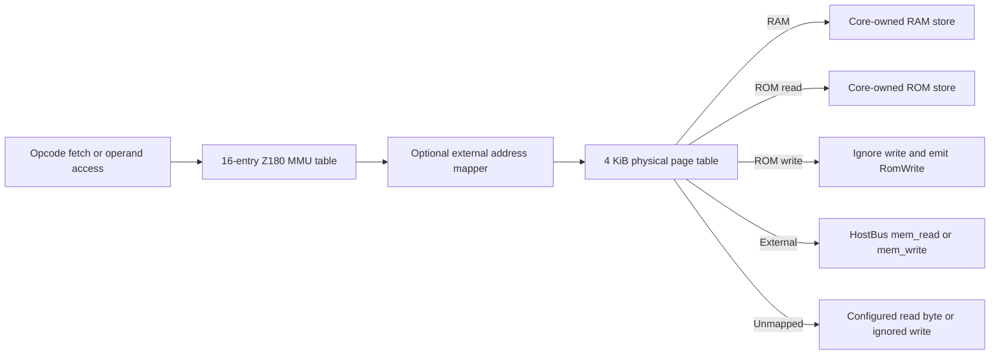
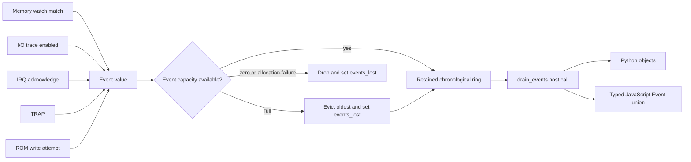

# z-core architecture

z-core is one Z180 CPU/SoC implementation with several host-facing entry
points. `z180-core` owns emulated state and behavior. The CLI, Python module,
and WebAssembly package translate host values into that core API; they do not
contain alternate CPU, MMU, timing, or peripheral implementations.

The design is deliberately deterministic. Emulated time advances only through
`step()` and `run()`. The core does not read a host clock, start threads, or use
randomness.

## Workspace

| Component | Responsibility |
| --- | --- |
| `crates/z180-core` | `no_std` + `alloc` CPU, memory, MMU, internal I/O, peripherals, interrupts, events, traces, disassembly metadata, and optional save states |
| `crates/z180-cli` | Raw-binary disassembly and execution, SST conformance execution, and the CP/M ZEX harness |
| `crates/z180-py` | CPython abi3 module `z180`, including the native `Machine` API and the qns compatibility surface |
| `crates/z180-wasm` | Browser and Node.js `Machine` API, strict TypeScript declarations, smoke ROM, and static browser demo |
| `tools/reference` | Independent UM0050-derived Python transitions, corpus generation, and differential properties; it is a test authority, not runtime code |
| `tests/sst` and `tests/z180-sst` | Pinned shared-Z80 cases and first-party Z180-specific cases |

`z180-core` forbids unsafe code. Its default build has no dependencies. The
optional `state` feature adds `serde` and `postcard` without enabling `std`.

## Core ownership

`Z180<B: HostBus>` owns all state that can affect deterministic execution:

- the complete CPU register file, interrupt state, HALT/SLP state, and cycle
  count;
- the internal memory page table and core-owned RAM and ROM stores;
- the 64-byte internal-I/O register file and the 16-entry logical MMU table;
- PRT, FRC, ASCI, CSI/O, and DMA state and queues;
- event, memory-watch, PC-watch, and instruction-trace state.

Construction takes a `MachineConfig` and a concrete `HostBus`. Configuration
selects the Z80180 or Z8S180 variant, physical address width, unmapped-read
value, event capacity, and initial memory regions. Region bases and sizes are
4 KiB aligned. RAM and ROM bytes are owned by the core; only `External` pages
call the host for memory accesses.

`HostBus` is the board boundary:

```rust
pub trait HostBus {
    fn mem_read(&mut self, phys: u32) -> u8;
    fn mem_write(&mut self, phys: u32, value: u8);
    fn io_read(&mut self, port: u16) -> u8;
    fn io_write(&mut self, port: u16, value: u8);
}
```

Keeping ordinary guest RAM inside `z180-core` avoids a host-language callback
on instruction fetches and data accesses. Hosts use external pages for
board-owned memory and I/O callbacks for devices outside the Z180 SoC.

## Instruction execution

One `step()` has a fixed ownership order:

1. Clear per-step timing accumulators and service eligible DMA work.
2. Check interrupts in hardware priority order. An accepted interrupt ends
   the CPU-instruction portion of the step.
3. Handle HALT or SLP, or capture `instruction_pc` and begin an optional
   instruction trace.
4. Fetch through logical memory and select the main, CB, ED, DD, FD, DDCB, or
   FDCB opcode table.
5. Trap an undefined encoding, or advance PC/R and call the descriptor's
   handler.
6. Resolve fixed, conditional, repeat, or variant-specific instruction
   timing; add DCNTL memory and I/O waits.
7. Advance FRC, PRT, ASCI, and CSI/O by the consumed cycles, then update the
   monotonic cycle count.

`run(budget)` repeats `step()` until it consumes at least the requested cycle
budget. It returns the actual count, which can exceed the budget by the final
instruction or interrupt. A sleeping machine with no accepted wake source can
return early when a step consumes zero cycles.

### Memory data flow

Every CPU fetch and operand access uses the same logical-memory path. The MMU
table converts a 16-bit logical address to the Z180's 20-bit physical output.
An optional board mapper can then translate that output before the physical
page lookup.



The physical page table spans `2^phys_addr_bits` bytes for widths from 20
through 24. Initial regions may not overlap. `remap()` replaces pages in an
existing machine and retires stores that no longer have live pages. Debugging
`mem_peek` and `mem_poke` use physical addresses and do not trigger memory
watches.

## Opcode and register tables

`optable.rs` is the instruction metadata authority. Each descriptor contains
the mnemonic, operand kinds, encoded length, timing form, and handler pointer.
The interpreter dispatch and `disassemble_one()` consume those descriptors;
there is no separate disassembler opcode table. Missing handlers represent
undefined encodings and enter the Z180 TRAP path.

`ioregs.rs` is the internal-register authority. Each of its 64 entries records
the reset byte, read and write masks, variant availability, and read/write
effects. Reads and writes apply the table before executing peripheral-specific
effects. The ICR-selected internal window accepts only zero-high-byte ports.
An internal access also performs the Z180-required duplicate external
`HostBus` I/O cycle; an external port goes directly to `HostBus`.

The MMU's CBR, BBR, and CBAR write effects rebuild all 16 logical-page bases.
Instruction fetches, CPU operands, and public `mmu_translate()` therefore
share the same mapping state. DMA address registers already hold physical
addresses, so DMA bypasses the CPU MMU but still uses the physical page table.

## Peripherals and interrupts

Peripherals are fields of the machine, not independent workers. `finish_step()`
advances them from the same cycle delta used by the CPU. ASCI and CSI/O expose
host-side byte queues while retaining transfer timing and status inside the
core. DMA runs through the same memory and I/O paths as the CPU, so mapping,
wait states, watches, and trace events remain consistent.

The interrupt controller owns priority and acknowledge behavior across TRAP,
NMI, the three external interrupt lines, PRT, DMA, CSI/O, and both ASCI
channels. Peripheral implementations only update their request conditions.
The instruction boundary decides whether a request is accepted and performs
the associated stack/vector transition.

## Events, watches, and traces

The event ring records externally useful facts without making events part of
CPU semantics. Producers include traced I/O, watched CPU/DMA memory accesses,
interrupt acknowledges, undefined-opcode traps, and attempted ROM writes.



The ring retains the newest configured number of events. Overflow is explicit:
`events_lost` remains set until the host clears it, resets the machine, or
loads a state in which it is clear. Draining does not clear that flag.

Instruction tracing is a separate optional ring. It captures the logical and
physical PC, entry cycle, fetched bytes, and decoded length without performing
extra memory reads. PC watches are counters rather than event producers and
are sampled once at instruction entry.

## Save states

With the `state` feature, `save_state()` writes a version byte followed by a
postcard payload. The payload includes CPU, memory, MMU-visible registers,
peripherals, timing remainders, events, watches, and instruction-trace state.
`load_state()` validates the version and decoded invariants before replacing
the emulated state.

The concrete `HostBus` and optional external address mapper are host wiring and
are not serialized. Loading a state preserves the machine object's existing
host integration while restoring deterministic emulated state.

## Host surfaces

- Rust callers instantiate `Z180<B>` directly and keep static dispatch for
  their bus implementation.
- `z180-cli` supplies harness-specific buses for `dis`, `run`, `sst`, and
  `zex`; instruction behavior still remains in `z180-core`.
- `z180-py` owns Python callbacks behind one concrete Rust bus and exposes the
  core API as `z180.Machine`. `z180.compat.Z180` translates the historical qns
  surface onto that native machine.
- `z180-wasm` owns JavaScript callbacks behind one concrete Rust bus and
  exposes the same machine operations through `wasm-bindgen`. A custom
  TypeScript section replaces loose generated values with strict config,
  trace, and discriminated event types.

Callback-backed external pages are intentionally the slow path. Native RAM
regions and the queue APIs are the normal integration path for complete system
emulators such as qns.

## Verification boundaries

Runtime implementation facts come from UM0050 and are recorded in
`docs/verification-log.md`. Shared Z80 behavior is checked with the pinned SST
corpus; Z180-only instructions, TRAP, and MMU behavior use the independent
first-party reference corpus and differential properties. ZEX exercises
documented instruction behavior end to end. Rust property tests cover
totality, arithmetic, MMU mapping, timing monotonicity, and save-state
continuation.

Existing emulator implementations are outside the architecture and the
source tree's trust boundary. They are neither runtime dependencies nor source
material.
